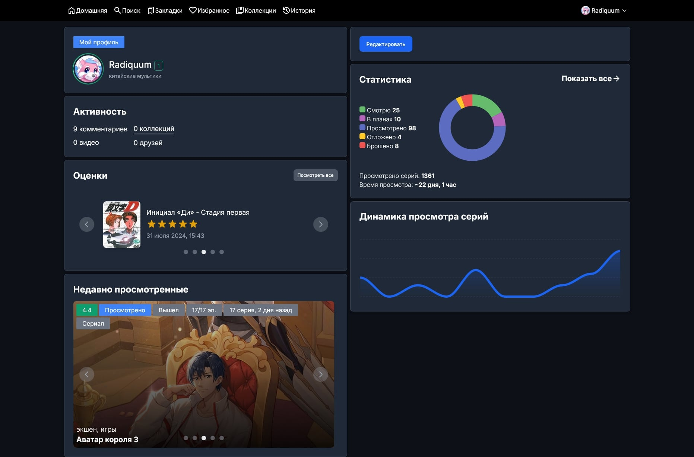

# AniX - Неофициальный веб клиент для Anixart

AniX - это неофициальный веб-клиент для Android-приложения Anixart. Он позволяет вам получать доступ к своей учетной записи Anixart и управлять ею из веб-браузера на вашем настольном компьютере или ноутбуке.

## Список изменений

- [3.1.0](/public/changelog/3.1.0.md)
- [3.0.1](/public/changelog/3.0.1.md)
- [3.0.0](/public/changelog/3.0.0.md)

[другие версии](/public/changelog)

## Отказ от ответственности

Пожалуйста, обратите внимание, что Anix является неофициальным проектом и не связан с разработчиками Anixart. Рекомендуется использовать официальное приложение Anixart для получения наиболее актуальных функций.

## Скриншоты

Короткий вид страниц

Полный вид страниц

Страница поиска

Страница релиза

Страница пользователя

## Возможности

1. Используйте свой существующий аккаунт на Anixart
2. Синхронизируйте списки, историю просмотров, коллекции и многое другое
3. используйте практически все функции приложения для Android

## Внесение вклада

Мы приветствуем вклад в этот проект! Если у вас есть какие-либо исправления ошибок, улучшения или новые функции, пожалуйста, не стесняйтесь отправлять запрос на обновление.
